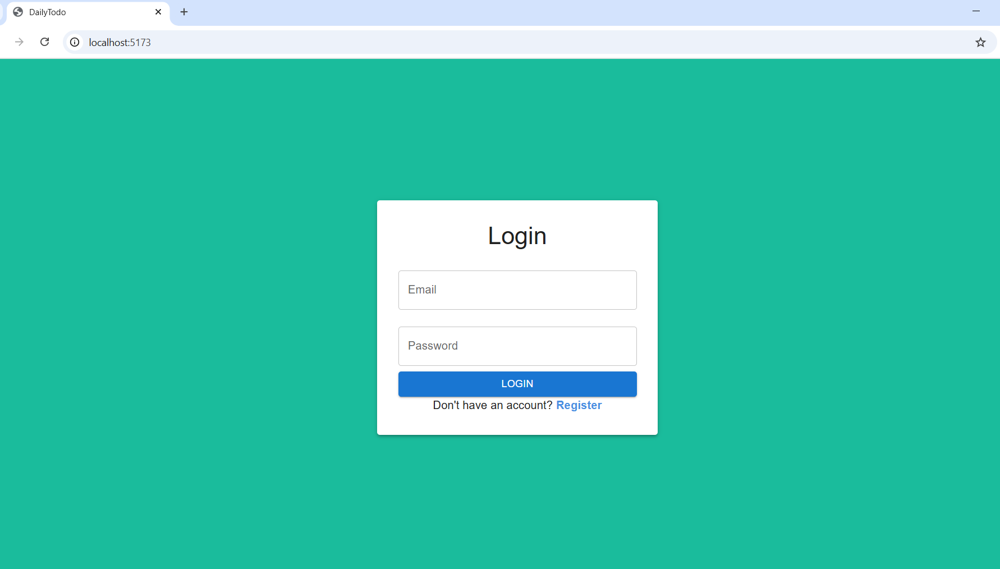
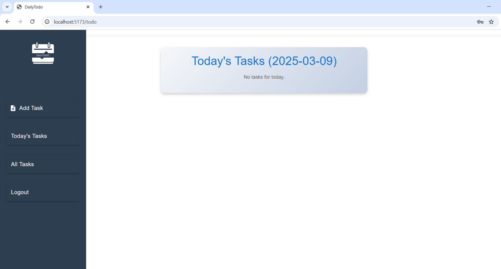
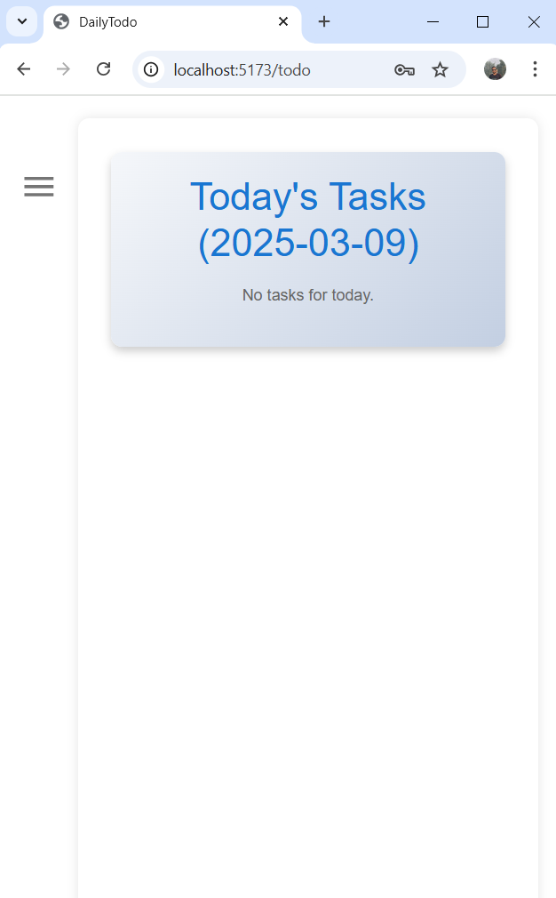

## Todo App

This is a **Todo App** built using **React (Vite) + Firebase** and hosted on Vercel. It allows users to register, log in, and manage their personal todo lists with real-time.

## 🛠️ Technologies Used

✅ Vite (React.js) – Frontend framework

✅ Firebase Authentication – User login & registration

✅ Material UI – UI components

✅ LocalStorage – Data persistence

✅ Vercel – Hosting platform

## 🚀 Features
✅ User Authentication (Firebase Authentication)

✅ Secure Database Storage (Firebase Firestore)

✅ Task Management (Add, View, Delete tasks)

✅ Task Prioritization (High, Medium, Low)

✅ Persistent Storage (LocalStorage & Firebase)

✅ Date-Wise Task Organization (Newest first)

✅ Responsive UI (Material UI + Custom Styling)
## 📂 Installation & Setup
Follow these steps to run the project locally:

1.Clone the repository:

    git clone https://github.com/yourusername/todo-app.git cd todo-app

2.Install the dependencies:

        npm install

3.Setup Firebase Credentials:

   Create a .env file in the root directory and add your Firebase configuration

        VITE_FIREBASE_API_KEY=your_api_key
        VITE_FIREBASE_AUTH_DOMAIN=your_auth_domain
        VITE_FIREBASE_PROJECT_ID=your_project_id
        VITE_FIREBASE_STORAGE_BUCKET=your_storage_bucket
        VITE_FIREBASE_MESSAGING_SENDER_ID=your_messaging_sender_id
        VITE_FIREBASE_APP_ID=your_app_id

 3.Run the Development Server:

       npm run dev

 4.Open the App

   
       Visit LocalHost in your browser.
## 🚀 Deployment on Vercel

The project is deployed on Vercel, ensuring seamless performance and accessibility online.  
##

    1. Push your project to GitHub.

    2. Go to Vercel Dashboard → New Project → Import your GitHub repo.

    3. Add the Environment Variables (same as .env file).

    4. Click Deploy.

## Screenshots

## Live Demo
 https://daily-todo-sepia.vercel.app/
## ⭐ Support & Contributions

If you like this project, please star 🌟 the repository and feel free to contribute by creating a pull request!
